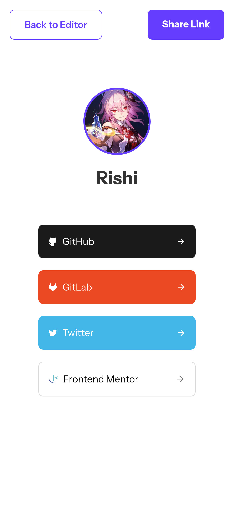
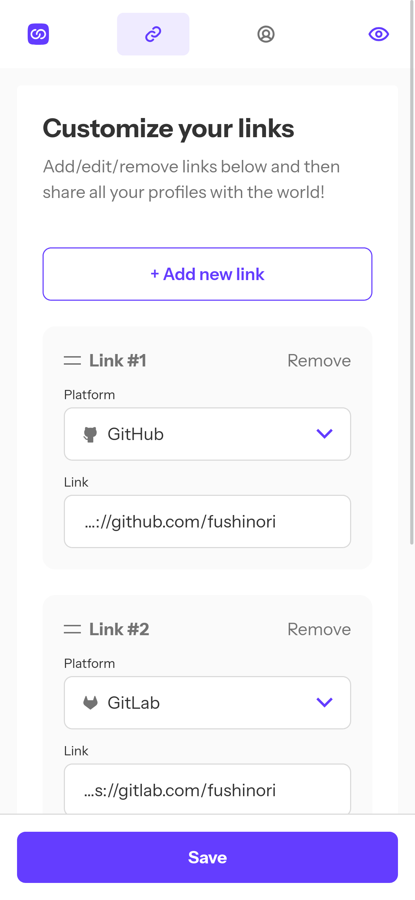
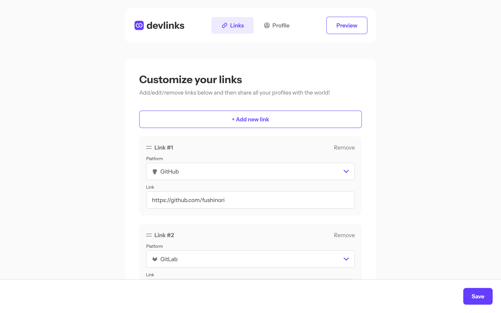
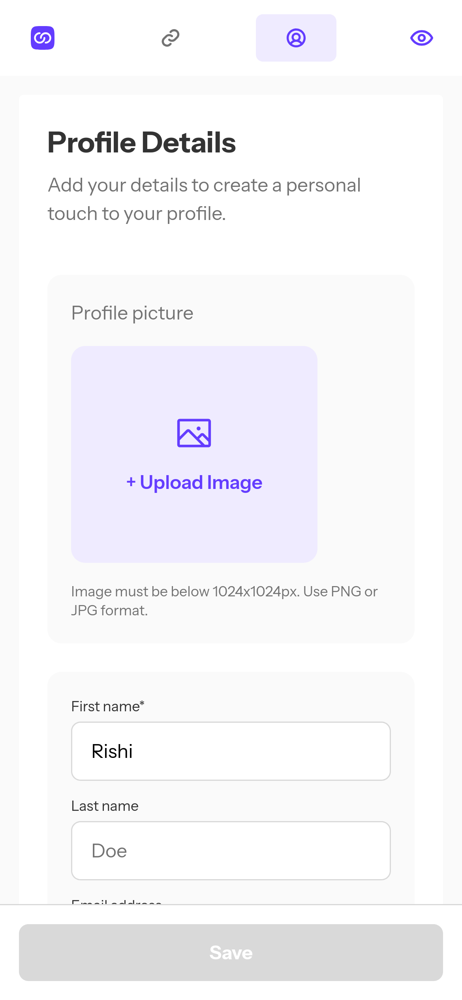
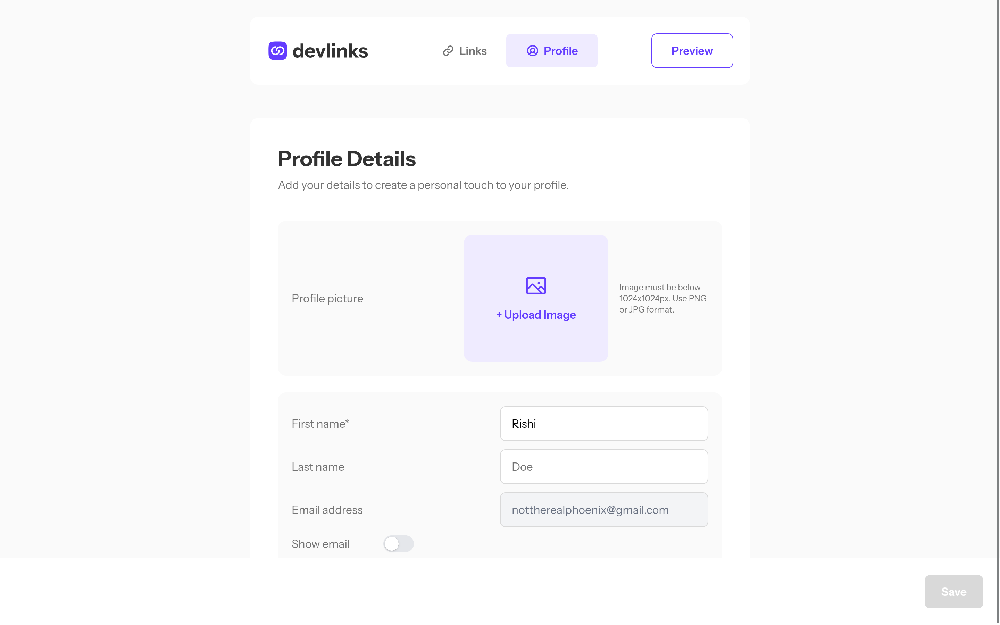

# Dev Links

Link sharing app for developers.

## Built with

- Next.js
- Tailwind CSS
- PostgreSQL
- [Better Auth](https://www.better-auth.com/)
- [dnd kit](https://dndkit.com/) - For drag & drop functionality
- [Conform](https://conform.guide/) and [Zod](https://zod.dev/) - Form validation
- [Resend](https://resend.com/) and [react email](https://react.email/) - For emails
- [Cloudflare R2](https://www.cloudflare.com/en-in/developer-platform/products/r2/) - Storage of user avatars

## Screenshots

  
Click to see screenshots

